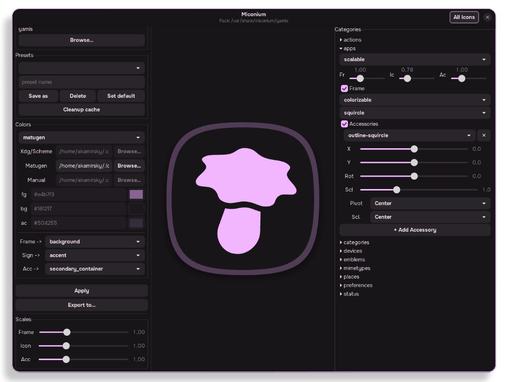
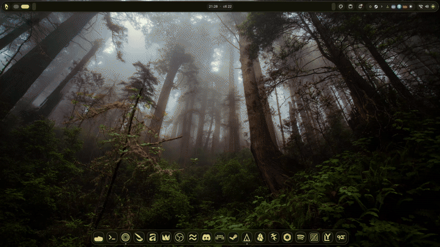

   
<div align="center">

# **miconium**
*pronounce*: **[maɪˈkoʊ.ni.əm]**

## Material Design SVG Icon Generator
</div>

___
<div align="center">

##  Contents
</div>

- [Showcase](#showcase)
- [Installation](#installation)
    - [Arch Linux](#arch-linux)
    - [Make](#via-make)
- [Post-install](#post-install-setup)
    - [Daemon](#daemon-setup)
    - [Matugen](#matugen-setup)
___

<div align="center">

## Showcase



</div>

___
<div align="center">

## Installation
</div>

> [!WARNING] 
> Non-systemd distros are temporarily unsupported

### Arch Linux
  - *Clone repository*
  ```bash
  git clone https://github.com/Y-Akamirsky/miconium.git
  cd miconium/install/arch-pkgbuild/
  ```
  - *Install*:
  ```bash
  makepkg -fsi
  ```
  > [!TIP]
  > You can remove cloned repo after install: `rm -rf ~/miconium`
  
### Via Make
  - *Clone repository*:
  ```bash
  git clone https://github.com/Y-Akamirsky/miconium.git
  cd miconium/
  ```
  - *Build project* (Depends on: cargo, make):
  ```bash
  make build
  ```
  - *Install*
  ```bash
  sudo make install
  ```
  > [!TIP]
  > Uninstall: `sudo make uninstall`

___
<div align="center">

## Post-install setup

### Daemon setup
</div>

> [!NOTE]
> Needed if you want to change your iconset "on the fly".

> [!WARNING]
> This daemon was tested and adapted mostly for Niri+DankMaterialShell! If you face a problem with another WM|DE or/and Shell|Dots - please write an issue or contribute with a Pull Request!

**Dry run**
```bash
miconiumd run
```

**Systemd service**
  - *Enable*
    ```bash
    systemctl --user enable --now miconiumd
    ```
  - *Disable*
    ```bash
    systemctl --user disable --now miconiumd
    ```

**Cleanup generated iconsets**
```bash
miconiumd cleanup-cache
```

<div align="center">

### Matugen setup
</div>

**Add the '[templates.miconium]' part to your matugen config**
> [!TIP]
> The template is installed along with the binaries at `/usr/share/miconium/matugen/template/miconium.json`

```toml
[config]

[templates.miconium]
input_path = '/usr/share/miconium/matugen/template/miconium.json'
output_path = '~/.local/share/miconium/matugen/matugen.json'
```