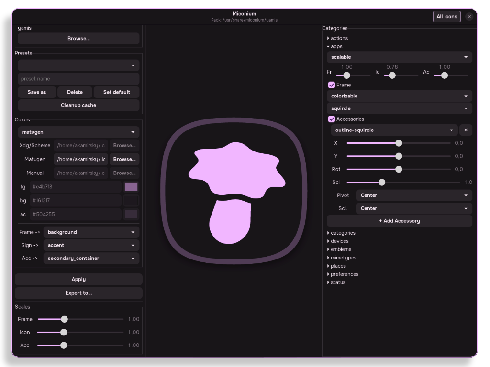
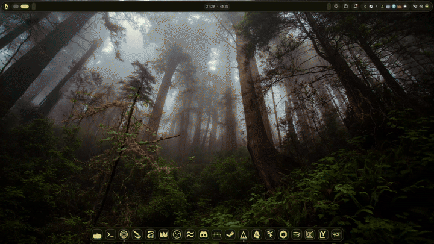

   
<div align="center">

# **miconium**
*произношение*: **[maɪˈkoʊ.ni.əm]**

## Генератор SVG-иконок в стиле Material Design
</div>

___
<div align="center">

## Содержание
</div>

[EN](README.md)

- [Демонстрация](#демонстрация)
- [Установка](#установка)
    - [Arch Linux](#arch-linux)
    - [Make](#через-make)
- [Icon-паки](#Icon-паки)
- [После установки](#настройка-после-установки)
    - [Демон](#настройка-демона)
    - [Matugen](#настройка-matugen)
- [Благодарности](#благодарности)
___

<div align="center">

## Демонстрация



</div>

___
<div align="center">

## Установка
</div>

> [!WARNING]
> Дистрибутивы без systemd временно не поддерживаются

### Arch Linux
- *Клонировать репозиторий*
```bash
git clone https://github.com/Y-Akamirsky/miconium.git
cd miconium/install/arch-pkgbuild/
```
- *Установить*:
```bash
makepkg -fsi
```
> [!TIP]
> После установки склонированный репозиторий можно удалить: `rm -rf ~/miconium`

### Через Make
- *Клонировать репозиторий*:
```bash
git clone https://github.com/Y-Akamirsky/miconium.git
cd miconium/
```
- *Собрать проект* (Зависимости: cargo, make):
```bash
make build
```
- *Установить*
```bash
sudo make install
```
> [!TIP]
> Удаление: `sudo make uninstall`

___
<div align="center">

## Icon-паки

</div>

Miconium нужен **icon-пак** — набор SVG-слоёв, из которых собирается тема.
Паки лежат в отдельном репозитории
**[`Y-Akamirsky/miconium-iconpack`](https://github.com/Y-Akamirsky/miconium-iconpack)**,
поэтому графика версионируется и обновляется **независимо от программы**:
обновление иконок не трогает установленный Miconium, а обновление Miconium не
трогает ваши иконки.

> [!IMPORTANT]
> Установка Miconium **не ставит** никаких иконок — пак вы выбираете отдельно.
> Без него Miconium нечего собирать.

*Установка официального пака `yamis`:*
```bash
# Arch
git clone https://github.com/Y-Akamirsky/miconium-iconpack
cd miconium-iconpack/install/arch-pkgbuild && makepkg -fsi

# любой дистрибутив
git clone https://github.com/Y-Akamirsky/miconium-iconpack
cd miconium-iconpack && sudo make install
```
После этого выберите пак в GUI или в конфиге:
```toml
[pack]
name = "yamis"
```

Свои пак(и) — скачанные или написанные — подхватываются автоматически из
`~/.local/share/miconium/<имя-пака>/`.

**Хочешь свой пак?** Пак — это просто директория SVG: сделай свои иконки,
свои подложки и свои украшения в любом стиле и проверь результат встроенным
скриптом (только bash):
```bash
git clone https://github.com/Y-Akamirsky/miconium-iconpack
./validate.sh my-pack
```
Структура описана в
[`PACK_STRUCTURE_RU.md`](https://github.com/Y-Akamirsky/miconium-iconpack/blob/main/PACK_STRUCTURE_RU.md).
Райсинг — это творчество, так что комбинируй всё свободно.

___
<div align="center">

## Настройка после установки

### Настройка демона
</div>

> [!NOTE]
> Нужен, если вы хотите менять набор иконок «на лету».

> [!WARNING]
> Этот демон тестировался и адаптировался преимущественно для Niri+DankMaterialShell! Если вы столкнулись с проблемой в другом WM|DE и/или Shell|Dots — пожалуйста, создайте issue или внесите вклад через Pull Request!

**Тестовый запуск**
```bash
miconiumd run
```

**Служба systemd**
- *Включить*
```bash
systemctl --user enable --now miconiumd
```
- *Отключить*
```bash
systemctl --user disable --now miconiumd
```

**Очистка сгенерированных наборов иконок**
```bash
miconiumd cleanup-cache
```

<div align="center">

### Настройка Matugen
</div>

**Добавьте раздел '[templates.miconium]' в свою конфигурацию matugen**
> [!TIP]
> Шаблон устанавливается вместе с файлами программы по пути `/usr/share/miconium/matugen/template/miconium.json`

```toml
[config]

[templates.miconium]
input_path = '/usr/share/miconium/matugen/template/miconium.json'
output_path = '~/.local/share/miconium/matugen/matugen.json'
```

>[!NOTE]
> Если у вас Dank Material Shell (DMS) - вы можете использовать его файл вместо пользовательского конфига ~/.cache/DankMaterialShell/dms-colors.json

> [!WARNING]
> Не будет работать если вы решите сменить шелл, основной вариант надежнее
___

<div align="center">

## Благодарности
</div>

- Базовый набор иконок — [Yet Another Monochrome Icon Set (YAMIS)](https://bitbucket.org/dirn-typo/yet-another-monochrome-icon-set/src/main/) 
- Айконпаки (ставятся отдельным пакетом) — [miconium-iconpack](https://github.com/Y-Akamirsky/miconium-iconpack)
